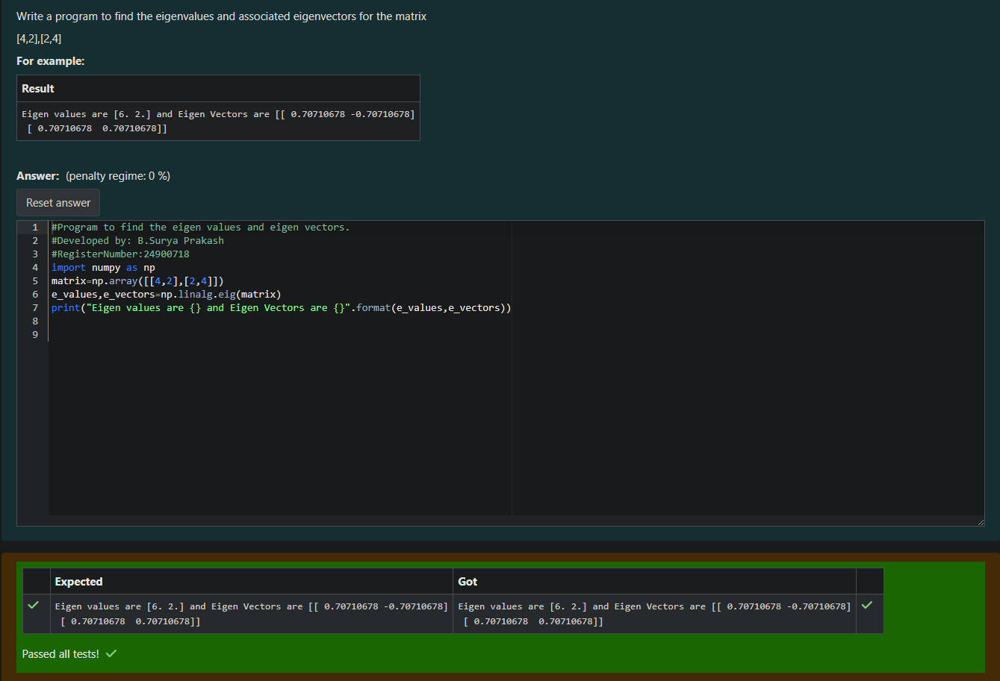

# EIGENVALUES-AND-EIGENVECTORS
## Aim:
To write a python program to find the Eigenvalues and Eigen Vectors
## Equipment’s required:
1. 	Hardware – PCs
2. 	Anaconda – Python 3.7 Installation / Moodle-Code Runner
## Algorithm:
### Step1 : Import the numpy library as np.
### Step 2: The matrix for which eigenvalues and eigenvectors need to be calculated is defined using numpy.array()
### Step 3: Using the np.linalg.eig(),  we get two results (first is eigenvalue and second is eigenvector) of the given matrix.
### Step 4: End the program

## Program:
    import numpy as np
    matrix=np.array([[4,2],[2,4]])
    e_values,e_vectors=np.linalg.eig(matrix)
    print("Eigen values are {} and Eigen Vectors are {}".format(e_values,e_vectors))

## Output:

## Result:
Thus the Eigenvalue and Eigenvector is successfully solved using python program
